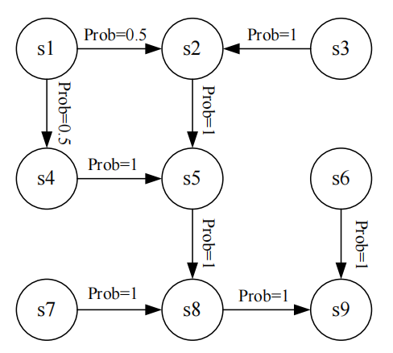

## State

**State**: The status $s_i$ (like location) of the agent with respect to the environment.

**State Space**:  Set of all possible states $\mathcal{S} = \{s_i\}$.

## Action

**Action**: Possible operations $a_i$ of agent for each state.

**Action space**: Set of all possible actions $\mathcal{A(s_i)} = \{a_i\}$.

## State transition

Agent moves from one state to another, the process is called state transition.

Denoted as $s_{1} \xrightarrow{a_1} s_{2}$.

**Forbidden area**: 

- Case 1: Accessible but with penalty.
- Case 2: Inaccessible.

**State transition probability**: At state $s_i$, and choose action $a_k$, with probability $p$ to transit to $s_j$, denoted as $p(s_2| s_1, a_1) = p$.

## Policy

Policy tells agent what actions to take at a state.

**Math**: $\pi (a| s)  = p$.  

## Reward

**Reward**: The real number we receive as a result of taking an action, which represents encouragement or punishment.

**Math**: $\pi (r=C | a, s)  = p$.

## Trajectory and return

**Trajectory**: A state-action-reward chain:
$$
s_{1} \xrightarrow[r=C_1]{a_1} s2 \xrightarrow[r=C_2]{a_2} s3
$$
**Return**: Sum of all rewards collected along the trajectory.

## Discounted return

A trajectory may be infinite. So we introduce a discount rate $\gamma \in [0, 1)$.

- If $\gamma$ close to $0$, return is dominated by the rewards obtained in the near future.
- If $\gamma$ close to $1$, return is dominated by the rewards obtained in the far future.

## Episode

Agent may stop at some terminal states. The resulting trajectory is called an **episode** (or a trial).

An episode is usually assumed to be a **finite** trajectory. Tasks with episodes are called **episodic tasks**. Some tasks without terminal states (where interaction with the environment never ends) are called **continuing tasks**.

Two options to unify episodic and continuing tasks:

- Treat the target state as a special absorbing state. Once the agent reaches these states, it will never leave, and subsequent rewards are $0$.
- Treat the target state as a normal state. The agent can still leave the target state.

## Markov decision process (MDP)

**Key elements**:

- Sets:

  - State
  - Action
  - Reward

- Probability distribution:

  - State transition probability: $p(s'| s, a)$
  - Reward probability: $p(r|s, a)$

- Policy

- Markov property:

  Memoryless property.
  $$
  p(s_{t+1} | a_{t+1}, s_t, \dots, a_1, s_0) = p(s_{t+1} | a_{t+1}, s_t) \\
  p(r_{t+1} | a_{t+1}, s_t, \dots, a_1, s_0) = p(r_{t+1} | a_{t+1}, s_t)
  $$

**Markov process**:

e.g.

Markov decision process becomes Markov process once the policy is given.