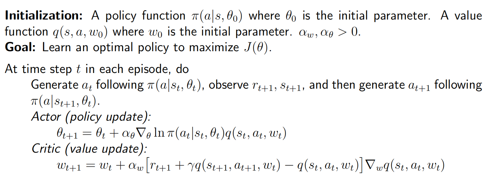
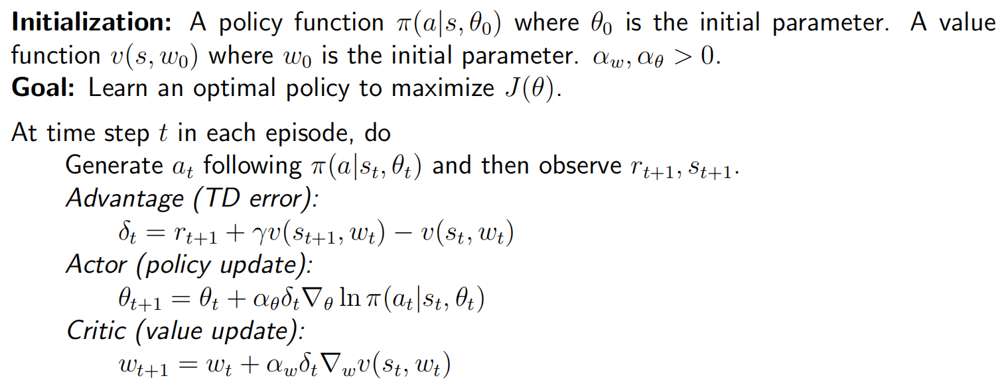
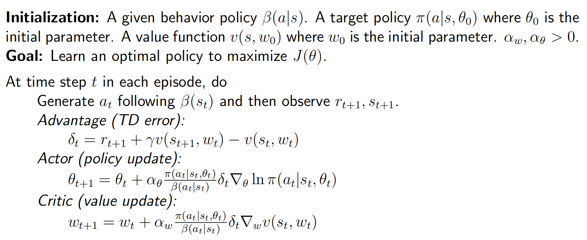
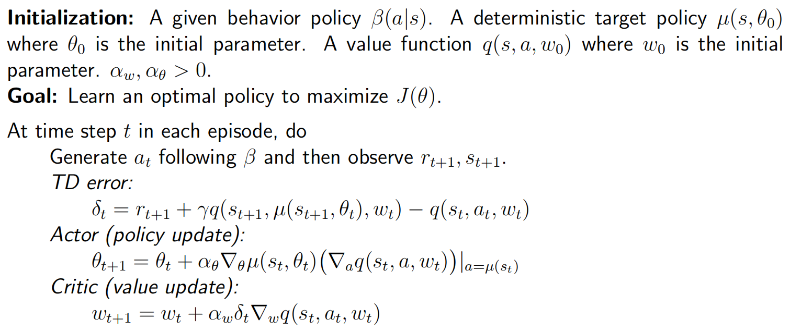

## The simplest actor-critic

According to the idea of policy gradient. The algorithm is
$$
\theta_{t+1}=\theta_{t}+\alpha\nabla_{\theta}\ln\pi(a_{t}|s_{t},\theta_{t})q_{t}(s_{t},a_{t})
$$
We can see "actor" and "critic":

-  The algorithm corresponds to actor.
-  The algorithm estimating $q_t(s, a)$ corresponds to actor.

If TD is used, such kind of algorithms are usually called **actor-critic**.

**Pseudocode**:

## Advantage actor-critic (A2C)

The core idea of this algorithm is to introduce a baseline to reduce estimation variance. 

### Baseline invariance

We can introduce an additional baseline, and
$$
\mathbb{E}_{S\sim\eta,A\sim\pi}\Big[\nabla_\theta\ln\pi(A|S,\theta_t)q_\pi(S,A)\Big]=\mathbb{E}_{S\sim\eta,A\sim\pi}\Big[\nabla_\theta\ln\pi(A|S,\theta_t)(q_\pi(S,A)-b(S))\Big]
$$

> Proof:
> $$
> \begin{aligned}
> \mathbb{E}_{S\sim\eta,A\sim\pi}\bigg[\nabla_\theta\operatorname{ln}\pi(A|S,\theta_t)b(S)\bigg]& \begin{aligned}&=\sum_{s\in\mathcal{S}}\eta(s)\sum_{a\in\mathcal{A}}\pi(a|s,\theta_t)\nabla_\theta\ln\pi(a|s,\theta_t)b(s)\end{aligned} \\
> &=\sum_{s\in\mathcal{S}}\eta(s)\sum_{a\in\mathcal{A}}\nabla_\theta\pi(a|s,\theta_t)b(s) \\
> &=\sum_{s\in\mathcal{S}}\eta(s)b(s)\nabla_\theta\sum_{a\in\mathcal{A}}\pi(a|s,\theta_t) \\
> &\begin{aligned}=\sum_{s\in\mathcal{S}}\eta(s)b(s)\nabla_\theta1=0.\end{aligned}
> \end{aligned}
> $$
>

Let
$$
X(S,A) = \nabla_\theta\ln\pi(A|S,\theta_t)[q_\pi(S,A)-b(S)]
$$
The optimal baseline that minimizes $\text{var}(X)$ is
$$
b^*(s)=\frac{\mathbb{E}_{A\sim\pi}\left[\|\nabla_\theta\ln\pi(A|s,\theta_t)\|^2q_\pi(s,A)\right]}{\mathbb{E}_{A\sim\pi}\left[\|\nabla_\theta\ln\pi(A|s,\theta_t)\|^2\right]},\quad s\in\mathcal{S}
$$
It is too complex to be useful in practice. We can obtain a suboptimal baseline that has a concise expression: 
$$
b^\dagger(s)=\mathbb{E}_{A\sim\pi}[q_\pi(s,A)]=v_\pi(s),\quad s\in\mathcal{S}
$$

### Algorithm description

When $b(s) = v_\pi(s)$,
$$
\begin{gathered}
\theta_{t+1} \begin{aligned}=\theta_t+\alpha\mathbb{E}\bigg[\nabla_\theta\ln\pi(A|S,\theta_t)[q_\pi(S,A)-v_\pi(S)]\bigg]\end{aligned} \\
=\theta_t+\alpha\mathbb{E}\Big\lceil\nabla_\theta\ln\pi(A|S,\theta_t)\delta_\pi(S,A)\Big\rceil. 
\end{gathered}
$$
where $\delta_\pi(S,A) = q_\pi(S,A)-v_\pi(S)$ and it is called the advantage function. $q_\pi(S,A)-v_\pi(S)$ indicates the **advantage** of the action.

The stochastic version:
$$
\begin{aligned}\theta_{t+1}&=\theta_t+\alpha\nabla_\theta\ln\pi(a_t|s_t,\theta_t)[q_t(s_t,a_t)-v_t(s_t)]\\&=\theta_t+\alpha\nabla_\theta\ln\pi(a_t|s_t,\theta_t)\delta_t(s_t,a_t)\end{aligned}
$$
**Pseudocode**:

## Off-policy actor-critic

Policy gradient is **on-policy** (because in the gradient $\nabla_{\theta}J(\theta) = \mathbb{E}_{S\sim \eta, A\sim \pi}[*]$. $A\sim \pi$, then $\pi$ is both behavior policy (when sampling) and target policy (to update)). We can use **importance sampling** to convert it to **off-policy**.

### Importance sampling

In case like we can get $p_0(x)$ but expression of $p_0(x)$ is unknown. We try to use ${X\sim p_1}$ to estimate $\mathbb{E}_{X\sim p_0}[X]$, Note that
$$
\mathbb{E}_{X\sim p_0}[X] = \sum_x p_1(x)\frac{p_0(x)}{p_1(x)}x = \mathbb{E}_{X\sim p_1}[f(X)]
$$
So
$$
\mathbb{E}_{X\sim p_0}[X] \approx \bar{f} = \frac{1}{n}\sum_{i=1}^n \frac{p_0(x_i)}{p_1(x_i)}x_i
$$

### Theorem (Off-policy policy gradient theorem)

The gradient of $J(\theta)$ is
$$
\nabla_{\theta}J(\theta) = \mathbb{E}_{S\sim\rho, A\sim\beta}\big[\frac{\pi(A|S,\theta)}{\beta(A|S)}\nabla_{\theta}\ln\pi(A|S,\theta)q_{\pi}(S, A)\big]
$$

### Algorithm description

To reduce the estimation variance, we can select the baseline as $b(S) = v_\pi(S)$ and get
$$
\nabla_{\theta}J(\theta) = \mathbb{E}_{S\sim\rho, A\sim\beta}\big[\frac{\pi(A|S,\theta)}{\beta(A|S)}\nabla_{\theta}\ln\pi(A|S,\theta)\big(q_{\pi}(S, A)-b(S)\big)\big]
$$
The corresponding stochastic gradient-ascent algorithm is
$$
\theta_{t+1}=\theta_{t}+\alpha_{\theta} \frac{\pi\left(a_{t} | s_{t}, \theta_{t}\right)}{\beta\left(a_{t} | s_{t}\right)} \nabla_{\theta} \ln \pi\left(a_{t} | s_{t}, \theta_{t}\right)(q_t(s_t, a_t) - v_t(s_t))
$$
 the advantage function $q_t(s_t, a_t) - v_t(s_t)$ can be replaced by TD error:
$$
q_t(s_t, a_t) - v_t(s_t) \approx r_{t+1} + \gamma v_t(s_{t+1}) - v_t(s_t) \doteq \delta_t(s_t, a_t)
$$
Then, the algorithm becomes
$$
\theta_{t+1}=\theta_{t}+\alpha_{\theta} \frac{\pi\left(a_{t} | s_{t}, \theta_{t}\right)}{\beta\left(a_{t} | s_{t}\right)} \nabla_{\theta} \ln \pi\left(a_{t} | s_{t}, \theta_{t}\right)\delta_t(s_t, a_t)
$$
**Pseudocode**:

 

## Deterministic actor-critic

The deterministic policy is specifically denoted as
$$
a = \mu(s, \theta) \doteq \mu(s)
$$
$\mu$ is a mapping from $\mathcal{S}$ to $\mathcal{A}$ and $\mu(s, \theta)$ can be written in short as $\mu(s)$.

Consider the metric of average state value 
$$
J(\theta) = \mathbb{E}[v_\mu(s)] = \sum_{s\in\mathcal{S}} d_0(s)v_\mu(s)
$$
We can apply the gradient-ascent algorithm to maximize $J(\theta)$:
$$
\theta_{t+1} = \theta_t + \alpha_\theta \mathbb{E}_{S\sim \eta}\big[\nabla_\theta \mu(S)(\nabla_a q_\mu(S, a))|_{a=\mu(S)}\big]
$$
The corresponding stochastic gradient-ascent algorithm is
$$
\theta_{t+1} = \theta_t + \alpha_\theta \nabla_\theta \mu(S)(\nabla_a q_\mu(S, a))|_{a=\mu(S)}
$$
**Pseudocode**:

