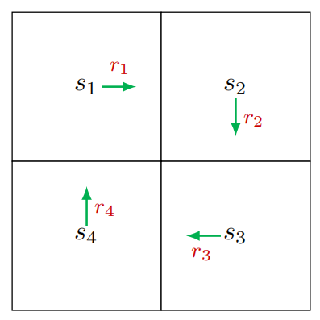
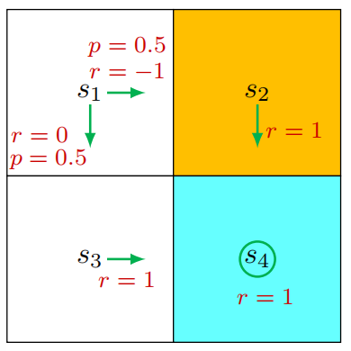

## How to calculate return

e.g.

- By definition.

  To calculate $v_1$:
  $$
  v_1 = r_1 + \gamma r_2 + \gamma^2 r_3 + \dots
  $$
  Similarly, $v_2, v_3, v_4$ can be obtained in the same manner.

- Bootstrapping.
  $$
  v_1 = r_1 + \gamma v_2
  $$
  Similarly, $v_2, v_3, v_4$ can be obtained in the same manner. And get a linear matrix-vector equation:
  $$
  \underbrace{\left[\begin{array}{l}
  v_{1} \\
  v_{2} \\
  v_{3} \\
  v_{4}
  \end{array}\right]}_{\mathbf{v}}=\left[\begin{array}{l}
  r_{1} \\
  r_{2} \\
  r_{3} \\
  r_{4}
  \end{array}\right]+\left[\begin{array}{l}
  \gamma v_{2} \\
  \gamma v_{3} \\
  \gamma v_{4} \\
  \gamma v_{1}
  \end{array}\right]=\underbrace{\left[\begin{array}{l}
  r_{1} \\
  r_{2} \\
  r_{3} \\
  r_{4}
  \end{array}\right]}_{\mathbf{r}}+\gamma \underbrace{\left[\begin{array}{llll}
  0 & 1 & 0 & 0 \\
  0 & 0 & 1 & 0 \\
  0 & 0 & 0 & 1 \\
  1 & 0 & 0 & 0
  \end{array}\right]}_{{P}} \underbrace{\left[\begin{array}{l}
  v_{1} \\
  v_{2} \\
  v_{3} \\
  v_{4}
  \end{array}\right]}_{\mathbf{v}}
  $$
  i.e.
  $$
  \mathbf{v} = \mathbf{r} + \gamma P\mathbf{v}
  $$
  And get $\mathbf{v}$ by $\mathbf{v} = (I - \gamma P) ^ {-1} \mathbf{r}$

## State value

### Some notations

Consider the single-step process:
$$
S_t \xrightarrow{A_t} R_{t+1}, S_{t+1}
$$

- $S_t$：State at time $t$
- $A_t$：Action taken at state $S_t$
- $R_{t+1}$：Reward after taking $A_t$
- $S_{t+1}$：State transited to after taking $A_t$

This step is governed by the following probability distributions:

- $S_t \to A_t$ is governed by $\pi (A_t=a | S_t = s)$
- $S_t, A_t \to R_{t+1}$ is governed by $p (R_{t+1} = r | S_t = s, A_t=a)$
- $S_t, A_t \to S_{t+1}$ is governed by $p (S_{t+1} = s' | S_t = s, A_t=a)$

Multi-step trajectory:
$$
S_t \xrightarrow{A_t} R_{t+1}, S_{t+1} \xrightarrow{A_{t+1}} R_{t+2}, S_{t+2} \dots
$$
The discounted return is:
$$
G_t = R_{t+1} + \gamma R_{t+2} + \gamma^2 R_{t+3} + \dots
$$

The expectation of $G_t$ is defined as state-value function or simply state value:
$$
v_{\pi}(s) = \mathbb{E} [G_t|S_t = s]
$$
$v_{\pi}(s)$ depends on policy $\pi$. The value of a state may vary with different policies.

> State value is expectation of all possible returns.

Here is the example of policy $\pi$, and 
$$
v_{\pi}(s_1) = 0.5\times(-1 + 1\times \gamma + 1\times \gamma^2 + \dots) + 0.5\times(0 + 1\times \gamma + 1\times \gamma^2 + \dots) = -0.5 + \frac{\gamma}{\gamma - 1}
$$

## Deriving the Bellman equation

The return $G_t$ of a trajectory can be written as:
$$
G_t = R_{t+1} + \gamma G_{t+1}
$$
So
$$
v_{\pi}(s) = \mathbb{E}(G_t|S_t = s) = \mathbb{E}(R_{t+1}|S_t = s) + \gamma\mathbb{E}(G_{t+1}|S_t = s)
$$

For $\mathbb{E}(R_{t+1}|S_t = s)$:
$$
\begin{align}
\mathbb{E}(R_{t+1}|S_t = s) &= \sum_a \pi(a|s)\mathbb{E}(R_{t+1}|S_t=s, A_t=a) \\
 &= \sum_a \pi(a|s) \sum_{r} p(r|s, a)r 
 \end{align}
$$
For $\mathbb{E}(G_{t+1}|S_t = s)$:
$$
\begin{align}
\mathbb{E}(G_{t+1}|S_t = s) &= \sum_{s'}\mathbb{E}(G_{t+1}|S_t = s, S_{t+1}=s')p(s'|s) \\
&= \sum_{s'}\mathbb{E}(G_{t+1}|S_{t+1}=s')p(s'|s) \\
&= \sum_{s'} v_{\pi}(s')p(s'|s) \\
&= \sum_{s'} v_{\pi}(s')\sum_{a} p(s'|s, a)\pi(a|s)
\end{align}
$$

Therefore,
$$
\begin{align}
v_{\pi}(s) &= \sum_a \pi(a|s) \sum_{r} p(r|s, a)r + \gamma\sum_{s'} v_{\pi}(s')\sum_{a} p(s'|s, a)\pi(a|s) \\
& = \sum_a \pi(a|s) \sum_{r} p(r|s, a)r + \gamma\sum_{a} \pi(a|s)\sum_{s'} v_{\pi}(s')p(s'|s, a) \\
& = \sum_a \pi(a|s) \big[\sum_{r} p(r|s, a)r + \gamma \sum_{s'} v_{\pi}(s')p(s'|s, a)\big]
\end{align}
$$
Notice that this equation is about $v_{\pi}(s)$ and $v_{\pi}(s')$, so we can use bootstrapping to solve the **equations** (like equations of all states) of states.

## Matrix vector form of the Bellman equation

Rewrite the Bellman equation $v_{\pi}(s) =\sum_a \pi(a|s) \big[\sum_{r} p(r|s, a)r + \gamma \sum_{s'} v_{\pi}(s')p(s'|s, a)\big]$ as:
$$
v_{\pi}(s) = r_{\pi}(s) + \gamma \sum_{s'}v_{\pi}(s')p_{\pi}(s'|s)
$$
Thus, the **equations** for all states can be represented in matrix-vector form:
$$
v_{\pi} = r_{\pi} + \gamma P_{\pi}v_{\pi}
$$
where

- $v_{\pi} = [v_{\pi}(s_1), \dots, v_{\pi}(s_n)] ^ {T}$
- $r_{\pi} = [r_{\pi}(s_1), \dots, r_{\pi}(s_n)] ^ {T}$
- State transition matrix $P_{\pi}\in \mathbb{R} ^ {n\times n}$, where $[P_{\pi}]_{ij} = p_{\pi}(s_j|s_i)$

##  Solve state values

Why to solve state values?

- Foundation to find better policies.

The Bellman equation matrix-vector form is:
$$
v_{\pi} = r_{\pi} + \gamma P_{\pi}v_{\pi}
$$

- The closed-form solution is:
  $$
  v_{\pi} = (I - \gamma P_{\pi})^{-1}r_{\pi}
  $$

- To avoid the matrix inverse operation, use iterative solution:
  $$
  v_{k+1} = r_{\pi} + \gamma P_{\pi} v_k
  $$
  We can show that
  $$
  v_k \to v_{\pi} = r_{\pi} + \gamma P_{\pi}v_{\pi}, \quad k\to \infty
  $$

## Action value

- State value: the average return of starting from a state.
- Action value: the average return of starting from a state and taking an action.

Definition:
$$
q_{\pi}(s, a) = \mathbb{E}[G_t| S_t=s, A_t = a]
$$

And,
$$
v_{\pi}(s) = \sum_{a}\pi(a|s)q_{\pi}(s, a) \tag{1} \label{eq1}
$$
Recall that state value is given by:
$$
v_{\pi}(s)  = \sum_a \pi(a|s) \big[\sum_{r} p(r|s, a)r + \gamma \sum_{s'} v_{\pi}(s')p(s'|s, a)\big] \tag{2} \label{eq2}
$$
By comparing $(1)$ and $(2)$:
$$
q_{\pi}(s, a) = \sum_{r} p(r|s, a)r + \gamma \sum_{s'} v_{\pi}(s')p(s'|s, a) \tag{3} \label{eq3}
$$

- $(1)$ shows how to obtain state values from action values.
- $(3)$ shows how to obtain action values from state values.

