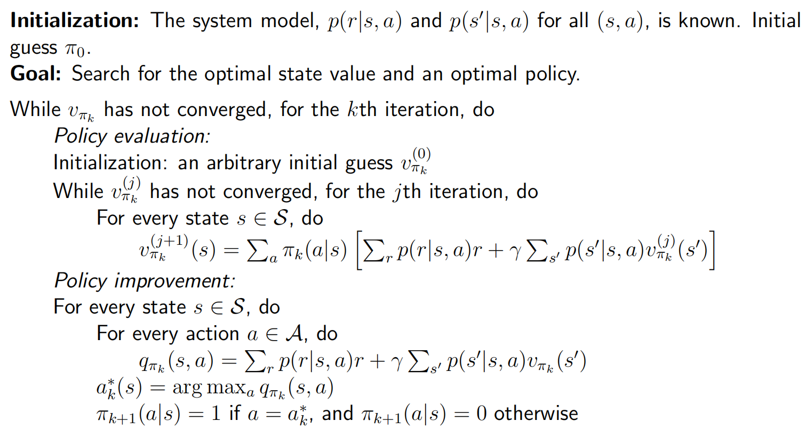

## Value iteration

The algorithm
$$
v_{k+1} = f(v_k) = \max_{\pi} (r_{\pi} + \gamma P_{\pi} v_k)
$$
is called **value iteration**, which can be decomposed to two steps

- Step 1: policy update (PU).
  $$
  \pi_{k+1} = \arg \max_{\pi} (r_{\pi} + \gamma P_{\pi} v_k)
  $$
  where $v_k$ is given.

- Step 2: value update (VU).
  $$
  v_{k+1} = r_{\pi_{k+1}} + \gamma P_{\pi_{k+1}} v_k
  $$

Procedure summary:
$$
v_k(s) \to q_k(s, a) \to \text{greedy policy } \pi_{k+1}(a|s) \to \text{new value } v_{k+1} = \max_a q_k(s, a)  
$$
Pseudocode:

## Policy iteration

Given a random initial policy $\pi_0$.

- Step 1: policy evaluation (PE)

  Get state value by
  $$
  v_{\pi_k} = r_{\pi_k} + \gamma P_{\pi_k}v_{\pi_k}
  $$

- Step 2: policy improvement (PI)
  $$
  \pi_{k+1} = \arg \max_{\pi} (r_{\pi} + \gamma P_{\pi}v_{\pi_k})
  $$

Procedure summary:
$$
\pi_0 \xrightarrow{PE} v_{\pi_0} \xrightarrow{PI} \pi_{1} \xrightarrow{PE} v_{\pi_1} \xrightarrow{PI} \pi_{2} \xrightarrow{\dots}
$$
Pseudocode:

## Truncated policy iteration

Based on $v_{\pi_1}^{(0)} = v_0 = v_{\pi_0}​$, we can compare the policy iteration algorithm and the value iteration algorithm, getting truncated policy iteration algorithm.
$$
\begin{align} 
v_{\pi_{1}}^{(0)}&=v_{0} \\
\text { value iteration } \leftarrow v_{1} \leftarrow v_{\pi_{1}}^{(1)}&=r_{\pi_{1}}+\gamma P_{\pi_{1}} v_{\pi_{1}}^{(0)} \\
v_{\pi_{1}}^{(2)}&=r_{\pi_{1}}+\gamma P_{\pi_{1}} v_{\pi_{1}}^{(1)} \\
&\vdots \\
\text { truncated policy iteration } \leftarrow \bar{v}_{1} \leftarrow v_{\pi_{1}}^{(j)}&=r_{\pi_{1}}+\gamma P_{\pi_{1}} v_{\pi_{1}}^{(j-1)} \\
&\vdots \\
\text { truncated policy iteration } \leftarrow {v}_{{\pi_1}} \leftarrow 
v_{\pi_{1}}^{(\infty)}&=r_{\pi_{1}}+\gamma P_{\pi_{1}} v_{\pi_{1}}^{(\infty)}
\end{align}
$$
