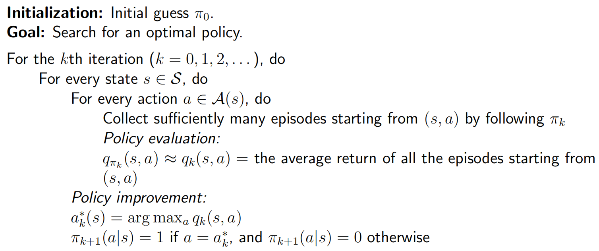
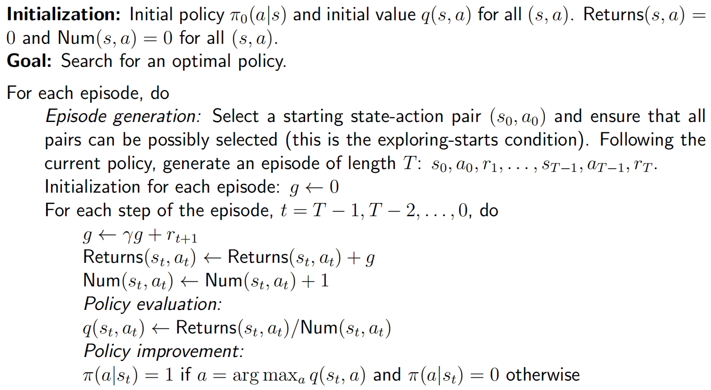
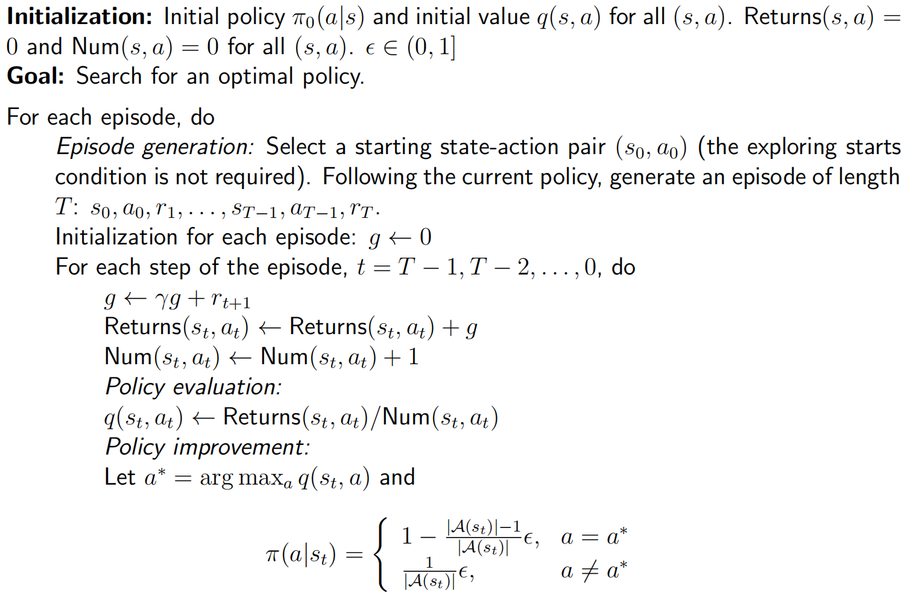

## Converting policy iteration to be model-free

Two expressions of action value:

- Expression 1 requires the model
  $$
  q_{\pi_k}(s, a) = \sum_{r}p(r|s, a)r + \gamma \sum_{s'}p(s'|s, a)v_{\pi_k}(s')
  $$

- Expression 2 does not requires the model
  $$
  q_{\pi_k}(s, a) = \mathbb{E}[G_t | S_t = s, A_t = a]
  $$

> Idea to achieve model-free RL: Use expression 2 to calculate $q_{\pi_k}(s, a)$ based on data.

### Procedure of Monte Carlo (MC) estimation of action values:

- Starting from $(s, a)$, following policy $\pi_k$, generate an episode.

- The return of episode is $g(s, a)$.

- $g(s, a)$ is a sample of $G_t$.

- Then
  $$
  q_{\pi_k}(s, a) = \mathbb{E}[G_t | S_t = s, A_t = a] \approx \frac{1}{N}\sum_{i=1}^n g^{(i)}(s, a)
  $$

### Pseudocode: MC Basic algorithm

> - MC Basic reveals the core idea of MC-based model-free RL, but not practical due to **low efficiency**.
> - MC Basic is a variant of the policy iteration algorithm.

## MC Exploring Starts

### Utilizing samples more efficiently

> Visit: every time a state-action appears in the episode, it is called a **visit** of that state-action pair.
>
> e.g.
> $$
> s_1 \xrightarrow{a_2} s_2 \to \dots
> $$
> $(s_1, a_2)$ is a pair.

Consider a episode, starting from $(s_1, a_1)$:

$s_1 \xrightarrow{a_1} s_2  \xrightarrow{a_2} s_3 \xrightarrow{a_3}  \dots$

The subepisode be viewed as a new episode. Like
$$
s_2  \xrightarrow{a_2} s_3 \xrightarrow{a_3} \dots \quad[\text{subepisode starting from} (s_2, a_2)] \\
s_3 \xrightarrow{a_3} \dots \quad [\text{subepisode starting from} (s_3, a_3)]
$$
These new episodes can be used to estimate more action values.

### Updating policies more efficiently

The strategy is to use the return of a single episode to approximate the corresponding action value.

**Pseudocode**:

## MC $\epsilon$-Greedy: Learning without exploring starts

An $\epsilon$-greedy policy is a stochastic policy that has a higher chance of choosing the greedy action and the same nonzero 

probability of taking any other action.
$$
\pi(a|s)=\left\{\begin{array}{ll}
1-\frac{\epsilon}{|\mathcal{A}(s)|}(|\mathcal{A}(s)|-1), & \text { for the greedy action, } \\
\frac{\epsilon}{|\mathcal{A}(s)|}, & \text { for the other }|\mathcal{A}(s)|-1 \text { actions, }
\end{array}\right.
$$
where $|\mathcal{A}(s)|$ denotes the number of actions associated with $s$.

**Pseudocode**:

