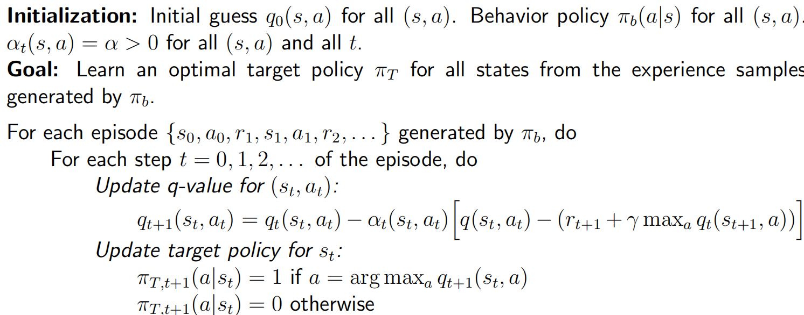

## TD learning of state values

> Note that:
>
> - TD learning often refers to a board class of RL algorithms.
> - It also refers to a specific algorithm for **estimating state values**.

### Algorithm description

$(s_0, r_1, s_1, \dots, s_r, r_{t+1}, s_{t+1}, \dots)$ (or, $\{(s_t, r_{t+1}, s_{t+1})\}_t$) generated by the given policy $\pi$.

The TD learning algorithm is
$$
\begin{aligned}v_{t+1}(s_t)&=v_t(s_t)-\alpha_t(s_t)\Big[v_t(s_t)-[r_{t+1}+\gamma v_t(s_{t+1})]\Big],\quad&(1)\\v_{t+1}(s)&=v_t(s),\quad\forall s\neq s_t,\quad&(2)\end{aligned}
$$
Here, $v_t(s_t)$ is the estimated state value of $v_{\pi}(s_t)$.

The algorithm can be annotated as
$$
\begin{aligned}&\underbrace{v_{t+1}(s_t)}_{\text{new estimate}}\:=\:\underbrace{v_t(s_t)}_{\text{current estimate}}\:-\alpha_t(s_t)\Big[\overbrace{v_t(s_t)-[\underbrace{r_{t+1}+\gamma v_t(s_{t+1})}_{\text{TD target }\bar{v}_t}]}^{\text{TD error }\delta_t}\Big]\end{aligned}
$$

- TD target $\bar{v}_t$ implies that the algorithm drives $v(s_t)$ toward $\bar{v}_t$.

  Be more detailed,
  $$
  \begin{aligned}
  &v_{t+1}(s_t)=v_t(s_t)-\alpha_t(s_t)\big[v_t(s_t)-\bar{v}_t\big] \\
  \Longrightarrow \quad &v_{t+1}(s_t)-\bar{v}_t=v_t(s_t)-\bar{v}_t-\alpha_t(s_t)\big[v_t(s_t)-\bar{v}_t\big] \\
  \Longrightarrow \quad &|v_{t+1}(s_t)–\bar{v}_t|=|1-\alpha_t(s_t)||v_t(s_t)–\bar{v}_t|
  \end{aligned}
  $$
  And $0<1-\alpha_t(s_t)<1​$ holds, so $v(s_t)​$ is driven toward $\bar{v}_t$

- TD error $\delta_t$ means difference between two consequent time steps.

Here, the algorithm only estimates the state value of a give policy.

###  The idea of  the algorithm

Here is a new expression of BE (Bellman equation).
$$
v_{\pi}(s) = \mathbb{E}[R+\gamma G|S=s], \quad s\in\mathcal{S}
$$
where $G$ is discounted return. Since
$$
\mathbb{E}[G|S=s] = \mathbb{E}[v_{\pi}(S')|S=s]
$$
where $S'$ is the next state, then
$$
v_{\pi}(s) = \mathbb{E}[R+\gamma v_{\pi}(S')|S=s], \quad s\in\mathcal{S}
$$
Then, solve the BE using RM algorithm. Define $g(v(s)) = v(s) - v_{\pi}(s)$. And we solve $g(v(s)) = 0$.

Since we only obtain the samples $r$ and $s'$ of $R$ and $S'$, the noisy observation we have is
$$
\begin{aligned}
\widetilde{g}(v(s))& = {v(s)}-\left[r+\gamma v_{\pi}(s^{\prime})\right] \\
&=\underbrace{\left(v(s)-\mathbb{E}\big[R+\gamma v_\pi(S')|s\big]\right)}_{g(v(s))}+\underbrace{\left(\mathbb{E}\big[R+\gamma v_\pi(S')|s\big]-\big[r+\gamma v_\pi(s')\big]\right)}_{\eta}
\end{aligned}
$$
So we can apply RM
$$
\begin{aligned}
v_{k+1}(s)& \begin{aligned}=v_k(s)-\alpha_k\tilde{g}(v_k(s))\end{aligned} \\
&=v_k(s)-\alpha_k\Big(v_k(s)-\left[r_k+\gamma v_\pi(s_k')\right]\Big),\quad k=1,2,3,\ldots\quad\textbf{(6)}
\end{aligned}
$$
There are two assumptions and corresponding modification:

- We must have experience set $\{(s, r, s')\}$ for $k=1,2,3\dots$

  We can change $\{(s, r, s')\}$ to $\{(s_t, r_{t+1}, s_{t+1})\}$ so that the algorithm can utilize the sequential samples in an episode.

- We assume that $v_{\pi}(s')$ is already known for any $s'$.

  We can replace $v_{\pi}(s')$ by an estimate $v_k(s')$.

**Theorem** (Convergence of TD Learning):

$v_t(s)$ converges w.p.1 to $v_{\pi}(s)$ for all $s\in \mathcal{S}$ as $t\to \infty$ if $\sum_t \alpha_t (s) = \infty$ and $\sum_t \alpha^2_t(s) < \infty$.

## TD learning of action values - Sarsa

### Algorithm

First, our aim is to estimate **action values** of give policy $\pi$.

Suppose we have some experience $\{(s_t, a_t, r_{t+1}, s_{t+1}, a_{t+1}\}$.

Use following algorithm to estimate action values:
$$
\begin{aligned}&q_{t+1}(s_t,a_t)=q_t(s_t,a_t)-\alpha_t(s_t,a_t)\Big[q_t(s_t,a_t)-[r_{t+1}+\gamma q_t(s_{t+1},a_{t+1})]\Big],\\&q_{t+1}(s,a)=q_t(s,a),\quad\forall(s,a)\neq(s_t,a_t),\end{aligned}
$$

- $q_t(s_t, a_t)$ is an estimate of $q_{\pi}(s_t, a_t)$;
- $\alpha_t(s_t, a_t)$ is the learning rate depending on $(s_t, a_t)$.

The algorithm is solving the following equation (another expression of BE expressed in terms of action values):
$$
q_{\pi}(s,a)=\mathbb{E}\left[R+\gamma q_{\pi}(S',A')|s,a\right],\quad\forall s,a.
$$
**Theorem** (Convergence of Sarsa Learning):

$q_t(s, a)$ converges w.p.1 to action value $q_{\pi}(s, a)$ as $t\to \infty$ for all $(s, a)$ if $\sum_t \alpha_t (s, a) = \infty$ and $\sum_t \alpha^2_t(s, a) < \infty$.

**Pseudocode**:

## TD learning of action values - Expected Sarsa

The algorithm:
$$
\begin{aligned}
q_{t+1}(s_t,a_t)& =q_t(s_t,a_t)-\alpha_t(s_t,a_t)\Big\lfloor q_t(s_t,a_t)-(r_{t+1}+\gamma\mathbb{E}[q_t(s_{t+1},A)])\Big\rfloor  \\
q_{t+1}(s,a)& =q_t(s,a),\quad\forall(s,a)\neq(s_t,a_t), 
\end{aligned}
$$
where
$$
\mathbb{E}[q_t(s_{t+1}, A)] = \sum_{a} \pi_t(a|s_{t+1})q_t(s_{t+1}, a) = v_t(s_{t+1})
$$
Compared to Sarsa:

- The TD target is changed from $r_{t+1} + \gamma q_t(s_{t+1}, a_{t+1})$ as in Sarsa to $r_{t+1} + \gamma \mathbb{E}[q_t(s_{t+1}, A)]$.
- Need more computation.
- Reduces random variables in Sarsa (from $\{(s_t, a_t, r_{t+1}, s_{t+1}, a_{t+1}\}$ to $\{(s_t, a_t, r_{t+1}, s_{t+1}\}$).

The algorithm is solving the following equation (another expression of BE expressed in terms of action values):
$$
q_{\pi}(s,a)=\mathbb{E}\left[R+\gamma v_{\pi}(S')|s,a\right],\quad\forall s,a.
$$

## TD learning of action values - $n$-step Sarsa

Unify Sarsa and MC learning:
$$
\begin{aligned}
\text{Sarsa}\longleftarrow G_{t}^{(1)}& =R_{t+1}+\gamma q_{\pi}(S_{t+1},A_{t+1}), \\
G_t^{(2)}& =R_{t+1}+\gamma R_{t+2}+\gamma^2q_\pi(S_{t+2},A_{t+2}), \\
&\vdots\\
n\text{-step Sarsa}\longleftarrow G_t^{(n)}& =R_{t+1}+\gamma R_{t+2}+\cdots+\gamma^{n}q_{\pi}(S_{t+n},A_{t+n}), \\
&\vdots\\
\text{MC}\longleftarrow G_{t}^{(\infty)}& =R_{t+1}+\gamma R_{t+2}+\gamma^{2}R_{t+3}+\ldots 
\end{aligned}
$$
$n$-step Sarsa aims to solve:
$$
q_\pi(s,a)=\mathbb{E}[G_t^{(n)}|s,a]=\mathbb{E}[R_{t+1}+\gamma R_{t+2}+\cdots+\gamma^nq_\pi(S_{t+n},A_{t+n})|s,a]
$$
The corresponding algorithm for solving the above equation:
$$
q_{t+1}(s_t,a_t)=q_t(s_t,a_t)-\alpha_t(s_t,a_t)\Big[q_t(s_t,a_t)-\big(r_{t+1}+\gamma r_{t+2}+\cdots+\gamma^nq_t(s_{t+n},a_{t+n})\big)\Big]
$$
We need to wait until $t+n$ to update the q-value of $(s_t, a_t)$.

The corresponding algorithm can be rewritten as:
$$
q_{t+n}(s_t,a_t)=q_{t+n-1}(s_t,a_t)-\alpha_{t+n-1}(s_t,a_t)\Big[q_{t+n-1}(s_t,a_t)-\Big(r_{t+1}+\gamma r_{t+2}+\cdots+\gamma^nq_{t+n-1}(s_{t+n},a_{t+n})\Big)\Big]
$$

## Q-learning 

### Q-learning - Algorithm

The algorithm is
$$
\begin{aligned}
q_{t+1}(s_t,a_t)& =q_t(s_t,a_t)-\alpha_t(s_t,a_t)\left[q_t(s_t,a_t)-[r_{t+1}+\gamma\max_{a\in\mathcal{A}}q_t(s_{t+1},a)]\right], \\
q_{t+1}(s,a)& =q_t(s,a),\quad\forall(s,a)\neq(s_t,a_t), 
\end{aligned}
$$
aims to solve
$$
q(s,a)=\mathbb{E}\left[R_{t+1}+\gamma\max_aq(S_{t+1},a)\Big|S_t=s,A_t=a\right],\quad\forall s,a.
$$
This is the **Bellman optimality equation** expressed in terms of action values.

### Off-policy vs on-policy

There exists two policies in a TD learning task:

- Behavior policy: to generate experience examples
- Target policy: is constantly updated toward an optimal policy

On-policy: when behavior policy is the **same** as target policy.

Off-policy: when they are **different**.

### Implementation

**Pseudocode**:

On-policy version:

Off-policy version:

## A unified point of view

$$
\begin{array}{l|l}
\hline \text { Algorithm } & \text { Expression of the TD target } \bar{q}_{t} \\
\hline \text { Sarsa } & \bar{q}_{t}=r_{t+1}+\gamma q_{t}\left(s_{t+1}, a_{t+1}\right) \\
\hline n \text {-step Sarsa } & \bar{q}_{t}=r_{t+1}+\gamma r_{t+2}+\cdots+\gamma^{n} q_{t}\left(s_{t+n}, a_{t+n}\right) \\
\hline \text { Q-learning } & \bar{q}_{t}=r_{t+1}+\gamma \max _{a} q_{t}\left(s_{t+1}, a\right) \\
\hline \text { Monte Carlo } & \bar{q}_{t}=r_{t+1}+\gamma r_{t+2}+\gamma^{2} r_{t+3}+\ldots \\
\hline
\end{array}
$$

$$
\begin{array}{l|l}
\hline \hline \text { Algorithm } & \text { Equation to be solved } \\
\hline \text { Sarsa } & \text { BE: } q_{\pi}(s, a)=\mathbb{E}\left[R_{t+1}+\gamma q_{\pi}\left(S_{t+1}, A_{t+1}\right) \mid S_{t}=s, A_{t}=a\right] \\
\hline n \text {-step Sarsa } & \text { BE: } q_{\pi}(s, a)=\mathbb{E}\left[R_{t+1}+\gamma R_{t+2}+\cdots+\gamma^{n} q_{\pi}\left(S_{t+n}, A_{t+n}\right) \mid S_{t}=s, A_{t}=a\right] \\
\hline \text { Q-learning } & \text { BOE: } q(s, a)=\mathbb{E}\left[R_{t+1}+\gamma \max _{a} q\left(S_{t+1}, a\right) \mid S_{t}=s, A_{t}=a\right] \\
\hline \text { Monte Carlo } & \text { BE: } q_{\pi}(s, a)=\mathbb{E}\left[R_{t+1}+\gamma R_{t+2}+\gamma^{2} R_{t+3}+\ldots \mid S_{t}=s, A_{t}=a\right] \\
\hline

\end{array}
$$

