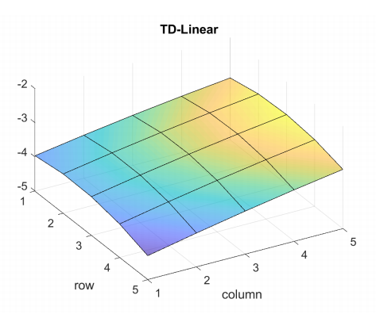
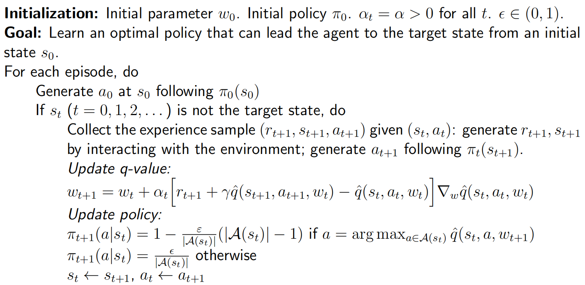
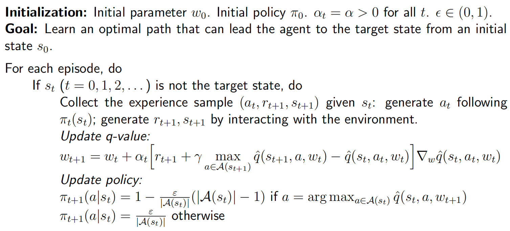
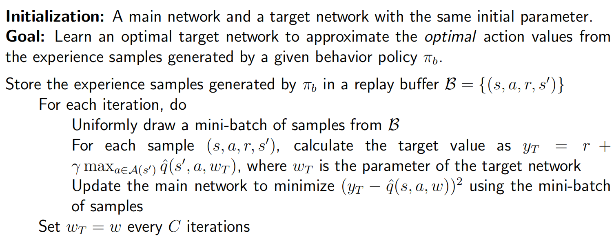

## Value representation: From table to function

Problems of tabular representation of state and action:

Difficult to handle large or continuous state or action spaces.

So we can consider cur fitting. 

> For example, suppose one-dimensional states $\mathcal{S}$ and their values $\{v_{\pi}(s_i)\}$. Since $|\mathcal{S}|$ is large, we can use a simple curve to approximate these dots to save. The simplest curve is a straight line, which can be described as
> $$
> \hat{v}(s,w)=as+b=\underbrace{[s,1]}_{\phi^T(s)}\underbrace{\left[\begin{array}{c}a\\b\end{array}\right]}_w=\phi^T(s)w
> $$
>

## TD learning of state values based on function approximation

### Objective function

Let $v_\pi(s)$ be true state value, $\hat{v}(s, w)$ be approximated state value. Then the problem to be solved is to find an optimal $w$ so that $\hat{v}(s, w)$ can best approximate $v_\pi(s)$ for every $s$.  The objective function is
$$
J(w) = \mathbb{E}\big[\big( v_\pi(S) - \hat{v}(s, w) \big)^2\big]
$$
where the expectation is calculated with respect to the random variable $S\in \mathcal{S}$.

 There are several ways to find probability distribution of $S$:

- The first way is to use a $uniform~distribution$. i.e.
  $$
  J(w)=\frac1n\sum_{s\in\mathcal{S}}(v_\pi(s)-\hat{v}(s,w))^2
  $$

- The second way is to use the $stationary~distribution$. More specifically, after the agent executes a given policy for a sufficiently long period, the probability of the agent being located at any state can be described by this stationary distribution. Let $d_\pi(s)$ denote the probability for the agent visiting s after a long period of time. Then
  $$
  J(w)=\sum_{s\in\mathcal{S}} d_\pi(s)(v_\pi(s)-\hat{v}(s,w))^2
  $$

  > Let $n_\pi(s)$ denote the number of times that $s$ has been visited in a very long episode generated by $\pi$.
  >
  > Then $d_\pi(s)$ can be approximated by
  > $$
  > d_\pi(s) \approx \frac{n_\pi(s)}{\sum_{s_k\in S}n_\pi(s_k)}
  > $$
  >

### Optimization algorithms

To minimize the objective function $J(w)$, we can use gradient descent:
$$
w_{k+1} = w_k - \alpha_k \nabla_w J(w_k)
$$
where
$$
\begin{aligned}
\nabla_w J(w_k) &= \mathbb{E}\big[\big( v_\pi(S) - \hat{v}(s, w_k) \big)\big] \\
&= - 2 \mathbb{E}\big[\big( v_\pi(S) - \hat{v}(s, w_k) \big) \nabla_w \hat{v}(s, w_k)\big]
\end{aligned}
$$
Therefore, the gradient descent algorithm is
$$
w_{k+1}=w_k+2\alpha_k\mathbb{E}[(v_\pi(S)-\hat{v}(S,w_k))\nabla_w\hat{v}(S,w_k)]
$$
where the coefficient 2 before $\alpha_k$ can be merged into $\alpha_k$. The algorithm requires calculating the expectation. We can replace the true gradient with a stochastic gradient:
$$
w_{t+1}=w_t+\alpha_t\big(v_\pi(s_t)-\hat{v}(s_t,w_t)\big)\nabla_w\hat{v}(s_t,w_t)
$$
It requires the true state value $v_\pi$, which is unknown and must be estimated. We can replace it with an approximation to make the algorithm implementable. There are two ways to do so:

- MC: Let $g_t$ be discounted return starting from $s_t$. Then $g_t$ can be an approximation of $v_\pi(s_t)$.
- TD learning: $r_{t+1} + \gamma \hat{v}(s_{t+1}, w_t)$ can be viewed as an approximation of $v_\pi(s_t)$.

### Selection of function approximators

How to select the function $\hat{v}(s, w)$?

- First approach is simply use a linear function $\hat{v}(s,w)=\phi^T(s)w$.

  It is difficult to select appropriate feature vectors. But it

  - can be better understood
  - is still powerful

  > Take $5\times 5$ grid world as an example,
  >
  > $\phi(s) = [1, x, y, x^2, y^2, xy]^T \in \mathbb{R}^6$. The result to fit $\hat{v}$ may be
  >
  > 

- The second is is to use an artificial neural network as a nonlinear function approximator.

### Analysis

The algorithm minimize the following function:

- True value error:
  $$
  J_E(w)=\mathbb{E}[(v_\pi(S)-\hat{v}(S,w))^2]=\|\hat{v}(w)-v_\pi\|_D^2
  $$

- Bellman error:
  $$
  J_{BE}(w)=\|\hat{v}(w)-(r_\pi+\gamma P_\pi\hat{v}(w))\|_D^2\doteq\|\hat{v}(w)-T_\pi(\hat{v}(w))\|_D^2
  $$

- Projected Bellman error:
  $$
  J_{PBE}(w)=\|\hat{v}(w)-MT_\pi(\hat{v}(w))\|_D^2
  $$
  where $M$ is a projection matrix.

## TD learning of action values based on function approximation

### Sarsa with function approximation

Suppose $\hat{q}(s, a, w)$ is an approximation of $q(s, a)$. Then
$$
\begin{aligned}w_{t+1}=w_t+\alpha_t\Big[r_{t+1}+\gamma\hat{q}(s_{t+1},a_{t+1},w_t)-\hat{q}(s_t,a_t,w_t)\Big]\nabla_w\hat{q}(s_t,a_t,w_t)\end{aligned}
$$
If use linear functions, we have
$$
\hat{q}(s,a,w) = \phi^T(s, a)w
$$
**Pseudocode**:

### Q-learning with function approximation

The update rule is
$$
w_{t+1}=w_t+\alpha_t\Big[r_{t+1}+\gamma\max_{a\in\mathcal{A}(s_{t+1})}\hat{q}(s_{t+1},a,w_t)-\hat{q}(s_t,a_t,w_t)\Big]\nabla_w\hat{q}(s_t,a_t,w_t)
$$
**Pseudocode**:

## Deep Q-learning

We can integrate deep neural networks into Q-learning to obtain an approach called deep Q-learning or **deep Q-network** (DQN).

### Algorithm description

The algorithm aims to minimize the following objective function:
$$
J(w) = \mathbb{E}\left[\left(R+\gamma\max_{a\in\mathcal{A}(S')}\hat{q}(S^{\prime},a,w)-\hat{q}(S,A,w)\right)^2\right]
$$

It is not easy to get $\nabla_w \max_{a\in\mathcal{A}(S')}\hat{q}(S^{\prime},a,w)$. So let $y = R+\gamma\max_{a\in\mathcal{A}(S')}\hat{q}(S^{\prime},a,w)$, and we assume that $w$ in $y$ is fixed when we calculate the gradient.

We introduce two networks:

- **Main network** $\hat{q}(s, a, w)$
- **Target network** $\hat{q}(s, a, w_T)$

Then
$$
J = \mathbb{E}\left[\left(R+\gamma\max_{a\in\mathcal{A}(S')}\hat{q}(S^{\prime},a,w_T)-\hat{q}(S,A,w)\right)^2\right]
$$
Implement details:

- In every iteration, we draw a mini-batch of samples $\{(s, a, r, s')\}$ from the replay buffer.
- Inputs of networks include state $s$ and action $a$. The target output is $y_T = r + \gamma\max_{a\in\mathcal{A}(S')}\hat{q}(S^{\prime},a,w_T)$. Then we directly minimize the TD error or called loss function $(y_T - \hat{q}(s, a, w))^2$ over the mini-batch $\{(s, a, y_T)\}$.

### Experience replay

What is Experience replay?

- Store the experience samples in a set, called replay buffer $\mathcal{B} = \{(s, a, r, s')\}$
- Every time we train the neural network, we can draw a mini-batch of random samples from the replay buffer.
- The draw of samples, or called **experience replay**, should follow a **uniform distribution**.

Why does the replay must follow a uniform distribution?

- The distribution of the state-action pair $(S, A)$ is assumed to be uniform. (If you have prior knowledge, you can set the weight)

**Pseudocode**:

