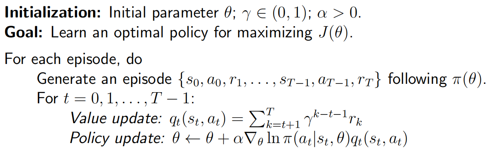

## Basic idea

Now, policies can be represented by parameterized functions:
$$
\pi(a|s, \theta)
$$
where $\theta \in \mathbb{R}^m$ is a parameter vector. It can also be written as $\pi(a, s, \theta), ~ \pi_\theta(a|s),$ or $\pi_\theta(a, s)$.

- The function can be, for example, a neural network:
  - Input: $s$
  - Output: probability to take each action
  - Parameter: $\theta$
- Advantage: high efficiency in terms of storage and generalization.

A policy $\pi$ is optimal if it can **maximize certain scalar metrics**. We need to calculate value of $\pi(a|s, \theta)$ by the function structure and the parameter. $\pi$ can only be updated by changing the $\theta$.

Basic idea is:
$$
\theta_{t+1}=\theta_t+\alpha\nabla_\theta J(\theta_t)
$$
Questions:

- How to design metrics?
- How to calculate the gradient of the metrics?
- ...

## Metrics to define optimal policies

### The average value

The metric is defined as
$$
\bar{v}_\pi = \sum_{s\in \mathcal{S}} d(s) v_\pi(s)
$$
$d(s)$ is a probability distribution. Then 
$$
\bar{v}_\pi = \mathbb{E}[v_\pi(S)]
$$
where $S \sim d$. And vector-product form is
$$
\bar{v}_\pi = \sum_{s\in \mathcal{S}} d(s) v_\pi(s) = d^T v_\pi
$$
To select distribution $d$, there are two cases:

- $d$ is independent of the $\pi$. In this case, we denote $d$ as $d_0$ and $\bar{v}_\pi$ as $\bar{v}_\pi^0$.

  To select $d_0$:

  -  One trivial way is $d_0(s) = \frac{1}{|\mathcal{S}|}$.
  - Only care about a specific state $s_0$, then $d_0(s_0)=1, ~ d_0(s\neq s_0) = 0$.

- $d$ depends on $\pi$. A common way is to select $d$ as $d_\pi$, which is the **stationary distribution** under $\pi$.

### The average reward

The second metric is average one-step reward or simply average reward.
$$
\bar{r}_\pi = \sum_{s\in \mathcal{S}}d_\pi(s)r_\pi(s) = \mathbb{E}[r_\pi(S)]
$$
where $S \sim d_\pi$. Here
$$
r_\pi(s) = \sum_{a\in \mathcal{A}} \pi(a|s)r(s, a)
$$
And
$$
r(s, a) = \mathbb{E}[R|s, a] = \sum_r rp(r|s, a)
$$

### Remarks

- All these metrics are functions of $\pi$.

- The metrics can be defined in either the discounted or the undiscounted case.

- The two metrics are equivalent to each other. When $\gamma < 1$, It holds that 
  $$
  \bar{r}_\pi = (1 - \gamma)\bar{v}_\pi
  $$

## Gradients of the metrics

Summary of the results about the gradients:
$$
\nabla_\theta J(\theta)=\sum_{s\in\mathcal{S}}\eta(s)\sum_{a\in\mathcal{A}}\nabla_\theta\pi(a|s,\theta)q_\pi(s,a)
$$
where

- $J(\theta)$ can be $\bar{v}_\pi, ~ \bar{r}_\pi$ or $\bar{v}_\pi^0$.
- $“=”$ may denote strict equality, approximation, or proportional to.
- $\eta$ is a distribution or weight of the states.

A compact and useful form:
$$
\begin{align}
\nabla_\theta J(\theta)&=\sum_{s\in\mathcal{S}}\eta(s)\sum_{a\in\mathcal{A}}\nabla_\theta\pi(a|s,\theta)q_\pi(s,a) \\
&= \mathbb{E}\big[\nabla_\theta\ln\pi(A|S,\theta)q_\pi(S,A)\big]
\end{align}
$$
where $S \sim \eta$ and $A \sim \pi(A|S,\theta)$. Then we can use samples to approximate the gradient:
$$
\begin{align}
\nabla_\theta J(\theta)
& \approx \nabla_\theta\ln\pi(A|S,\theta)q_\pi(S,A)
\end{align}
$$

> To prove:
> $$
> \begin{align}
> \nabla_\theta J(\theta)
> &= \mathbb{E}\big[\nabla_\theta\ln\pi(A|S,\theta)q_\pi(S,A)\big]
> \end{align}
> $$
> We have
> $$
> \nabla_\theta\ln\pi(a|s,\theta)=\frac{\nabla_\theta\pi(a|s,\theta)}{\pi(a|s,\theta)}
> $$
> So
> $$
> \begin{aligned}
> \nabla_{\theta}J& =\sum_sd(s)\sum_a\nabla_\theta\pi(a|s,\theta)q_\pi(s,a) \\
> &=\sum_{s}d(s)\sum_{a}\pi(a|s,\theta)\nabla_{\theta}\ln\pi(a|s,\theta)q_{\pi}(s,a) \\
> &=\mathbb{E}_{S\sim d}\left[\sum_{a}\pi(a|S,\theta)\nabla_{\theta}\ln\pi(a|S,\theta)q_{\pi}(S,a)\right] \\
> &=\mathbb{E}_{S\sim d,A\sim\pi}\big[\nabla_{\theta}\ln\pi(A|S,\theta)q_{\pi}(S,A)\big] \\
> &= \mathbb{E}\big[\nabla_{\theta}\ln\pi(A|S,\theta)q_{\pi}(S,A)\big]
> \end{aligned}
> $$
>

## Gradient-ascend algorithm

The algorithm is
$$
\begin{aligned}
\theta_{t+1}& =\theta_t+\alpha\nabla_\theta J(\theta) \\
&=\theta_t+\alpha\mathbb{E}\bigg[\nabla_\theta\ln\pi(A|S,\theta_t)q_\pi(S,A)\bigg]
\end{aligned}
$$
Replace the gradient by a stochastic one:
$$
\theta_{t+1}=\theta_t+\alpha\nabla_\theta\ln\pi(a_t|s_t,\theta_t)q_\pi(s_t,a_t)
$$
And use $q_t(s_t, a_t)$ to approximate $q_\pi(s_t, a_t)$.

And the algorithm can be rewritten as
$$
\begin{aligned}
\theta_{t+1}& =\theta_{t}+\alpha\nabla_{\theta}\ln\pi(a_{t}|s_{t},\theta_{t})q_{t}(s_{t},a_{t}) \\
&=\theta_{t}+\alpha\underbrace{\left(\frac{q_{t}(s_{t},a_{t})}{\pi(a_{t}|s_{t},\theta_{t})}\right)}_{\beta_{t}}\nabla_{\theta}\pi(a_{t}|s_{t},\theta_{t})
\end{aligned}
$$
The coefficient $\beta_t$ can well balance exploration and exploitation.

- Exploitation: If $q_t(s_t, a_t)$ is great, the $\beta_t$ is great.
- Exploration: If $\pi_t(a_t|s_t, \theta_t)$ is great, the $\beta_t$ is great.

**Pseudocode**:

